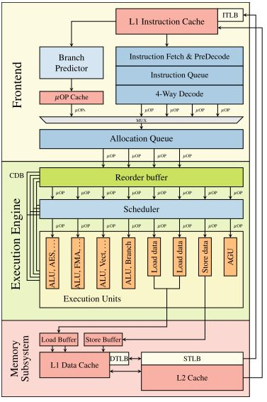
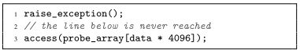
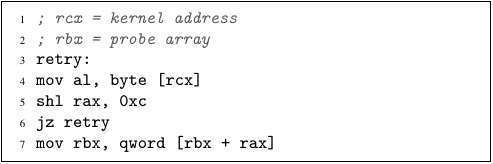
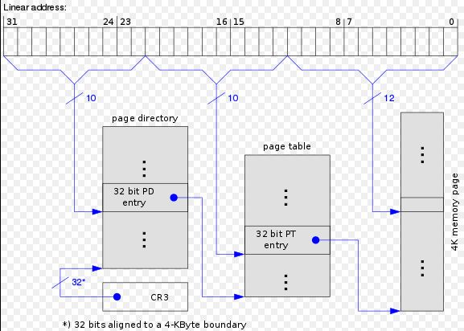
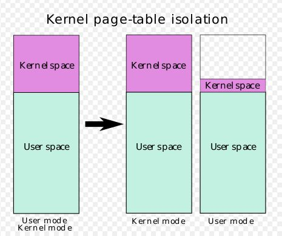

### Update Jan 16th 学者不可以不深思而慎取之
昨晚请教了龙芯的老师和同学，可以肯定三件事：
+ 龙芯处理器从微结构设计上对 Meltdown 免疫。
+ Intel 处理器被 Meltdown 攻击，是访存逻辑设计缺陷造成的。
+ 目前任何采用“乱序执行”技术的处理器理论上都无法避免 Spectre 的攻击。
<!-- more -->

龙芯之所以能够对 Meltdown 免疫，是因为龙芯处理器即使是在乱序执行时，也只执行合法的 load 指令。而 Intel 的处理器则是“不管三七二十一”，遇到访存指令就执行，这么做就给了 Meltdown 可乘之机。

现在看来，我之前的“ROB 相关论”（觉得是 Intel 的 ROB 比 AMD 和龙芯的都大，导致 Intel 在非法 load 指令提交之前，给后续的 load 指令提供了充足的时间）犯了一个“先入为主”诱导的错误：我先看到了 Meltdown 在 Intel 处理器上有效，于是判断“非法的 load 指令在乱序执行都会被执行，而精确例外在提交阶段才会上报”。但龙芯的老师和同学从处理器设计的角度看，“不管有没有乱序执行，非法的 load 指令都没有执行的必要”（访存指令是个大开销）。

“此所以学者不可以不深思而慎取之也！”

### 前言
周一晚上的“体系结构”课上，老师讲到了使 Intel 陷入危机的“Meltdown 攻击”。但在分析 Intel 的漏洞时，老师也不太清楚。我觉得，之所以龙芯、AMD 和 ARM 的处理器不受 Meltdown 的影响，很可能是它们的ROB（Reorder Buffer，参见图 1 Execution Engine 区域上方绿色方块），或是同等功能的部件容量不够大导致的。

### 乱序执行难以避免的“副作用”
根据 Meltdown 的[论文](https://meltdownattack.com/)，我们可以大致知道 Meltdown 攻击的原理（我也在自己上一篇文章中简述过）。但当看到论文中提到：
> 6.4 Limitations on ARM and AMD
>
> We also tried to reproduce the Meltdown bug on several ARM and AMD CPUs. However, we did not manage to successfully leak kernel memory with the attack described in Section 5, neither on ARM nor on AMD. The reasons for this can be manifold. First of all, our implementation might simply be too slow and a more optimized version might succeed. For instance, a more shallow out-of-order execution pipeline could tip the race condition towards against the data leakage. Similarly, if the processor lacks certain features, e.g., no re-order buffer, our current implementation might not be able to leak data. However, for both ARM and AMD, the toy example as described in Section 3 works reliably, indicating that out-of-order execution generally occurs and instructions past illegal memory accesses are also performed.

不由惊叹，其实乱序执行的副作用是任何厂家都难以避免的。这里提到的“副作用”，就是被诸如 Prime + Probe、Evict + Reload、Flush + Flush 等 side-channel attack 方式利用而导致的 cache 信息泄漏。（龙芯的老师认同这一点。这也是 Spectre 利用的一个地方。但 Spectre 是一系列攻击方案的集成，只要堵住其中的一环，整套方案也就无法生效。所以大家不用对处理器厂商的未来太过担心。）

基于论文中的上述结论，以及老师上课透漏的“龙芯对 Meltdown 免疫”，我猜测 AMD、龙芯等厂家的 CPU 没中招儿的原因很可能是 ROB 不如 Intel 的大。

我的想法很好理解，既然 AMD 和 ARM 在面对论文 Section 3 中提到的 the toy example 时，也中招儿，说明它们在乱序执行时，也向内存发出了无法回收的 load 指令（这条指令最终完成一半，导致相关数据进入 cache）。尽管后来发现自己预测错误，或者执行了越权代码，但此时 CPU 只能清理从“上一条指令提交”，到“抛出异常”之间，处理器内部的东西，比如我上篇文章提到的 rax' 等。而对于那些已经向 CPU 外部发出的其他指令，比如向内存发出的 load 指令，应该就“覆水难收”了。

Intel 的处理器，可能由于 ROB 很大，在 Meltdown 程序的第 4 条指令乱序执行结束，但“指令提交”之前，时间差充足，给后续各条指令的执行提供了机会，尤其是第 7 条指令。而 AMD、ARM 的处理器，可能由于微结构设计的不同，并不能在第 4 条指令乱序执行结束后，给第 7 条指令留有充足的时间，所以在第 7 条指令执行前，第 4 条指令就已经提交了，于是导致这两个厂家的处理器对 Meltdown 免疫，而在 the toy example 面前中招儿。

由此看来，乱序执行只要用了，就背负了“原罪”，就要面对 side-channel attack 的威胁。
（这个猜想是错误的。龙芯的老师和同学帮我指出了问题。真正的原因请看文章开头的 Update。）

### 解决 Meltdown 带来的威胁
Intel 处理器如何解决 Meltdown 带来的威胁？目前最好的答案是：拆分 Kernel space 和 User space。KAISER（现名叫 KPTI）做出了不错的示范。

想要知道 [KAISER](https://link.zhihu.com/?target=https%3A//gruss.cc/files/kaiser.pdf) 是怎么做到的，首先我们要回顾下“分页”相关的知识。

注意看上图左下角的 CR3，在 x86 平台下，页表机制由 Page directory 等组成的系统（32位系统中使用），或是 PML4 等组成的系统（64位系统中使用）实现。
为了实现“线性地址”到“物理地址”的高效转换，Intel 建议操作系统将 Kernel space 写到 User mode 的页表中（见下图左侧）。

>As recommended by Intel, today's operating systems map the kernel into the address space of every user process.

这样做的好处，简单讲，可以在不改变页表的情况下，实现某用户进程与内核进程（系统调用的实现）之间的切换。避免了用户进程由于系统调用（用户进程向内核进程切换）等而刷新 TLB 等，从而减少性能损失。

但这么做也产生了问题，由于 User mode 下的页表记录了 Kernel space 的信息，所以用户程序可以通过分析某一具体程序的运行情况，猜出处于 Kernel space 的某些重要信息的线性地址，从而使用 side-channel attack 方式“窃取”这些信息。上文中提到的 Meltdown 就是这么做的（Firefox 56 保存的用户密码就在 Meltdown 论文中被窃取）。

而 KAISER 的改进，在于突破页表的传统模式，将 User mode 下的页表样式改成了上图最右侧所示的情况。可以看到，最右侧的页表上面大部分为空白，只有少部分紫色区域。这样做的目的是尽可能少地，在 User mode 下的页表中，保留 Kernel space 中指令和数据的地址信息，只留下诸如 IDT （需要中断实现状态切换）等对用户态程序运行不可或缺的内核地址信息。（换句话说，就是操作系统不再告诉 APP 内核在哪，你自己瞎猜也没用，因为你 APP 猜的都是“线性地址”，除了我告诉你的 IDT 等之外，都是错的/不存在的。）

根据 KAISER 的这篇论文，我们可以知道它为用户态进程保留的内核地址信息（上图最右侧页表中间的紫色小块）包括：
>Minimizing the Kernel Address Space Mapping
>
> As x86 and Linux are built around using interrupts for context switches, it is necessary to map the interrupt descriptor table (IDT), as well as the interrupt entry and exit .text section. To enable multi-threaded applications to run on different cores, it is necessary to identify per-CPU memory regions and map them into the shadow address space. KAISER maps the entire per-CPU section including the interrupt request (IRQ) stack and vector, the global descriptor table (GDT), and the task state segment (TSS). Furthermore, while switching to privileged mode, the CPU implicitly pushes some registers onto the current kernel stack. This can be one of the per-CPU stacks that we already mapped or a thread stack. Consequently, thread stacks need to be mapped too.

KAISER 的改进，实现了内存中 User space 和 Kernel space 比较彻底的分离，从而帮助 Intel 真正解决 Meltdown 的威胁（AMD 和龙芯的处理器则不需要开启 KAISER）。

### 总结
这次 Meltdown 危机，归根结底是 Intel 访存逻辑设计不周密导致的。而目前的解决办法，是通过牺牲硬件效率，用软件委曲求全。

作为这次危机的亲历者，我很荣幸能够在这一重要历史事件发生的节点上，遇到龙芯公司的老师和同学。