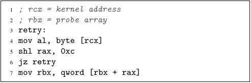
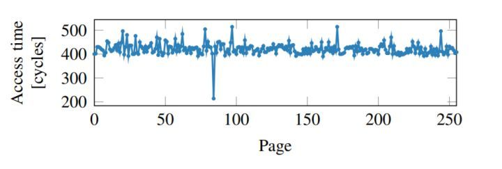

### Update Jan 10th：对 Intel 漏洞的猜测
假如 Intel 的乱序执行是指令不提交不报错，那么第4条指令越界取值到 rax'（重命名寄存器中的 rax 中间值），只要第4条不提交，第5条就根据 rax' 的值继续走，第6条指令接着走。然后 rbx' 坐等 probe 数组中部分数据进 cache（第7条指令）……

此时 ROB 中的第4条提交，CPU 更新状态寄存器示错，操作系统 kill 掉当前恶意进程（所有从上一条指令提交开始，到第4条指令提交结束期间，重命名寄存器中的所有中间值，比如 rax'、坐等数据的 rbx' 等都“无效+释放”，未完成的各种访存操作都“应该”取消）。

令人不解的是：在处理器中执行的第7条访存指令（几十上百周期完成）明明应该比 ROB 中第4条的提交结束的晚，可 CPU 在发现有问题后却并不取消这条“迎驾 probe 数组进 cache 的电流”（第7条指令）。这么做简直时出力不讨好，而且还导致 Meltdown 攻击问题。（赔了夫人又折兵？）

-----

### Meltdown关键代码分析
周一上课，老师提到了Meltdown程序。它的作用是利用Intel处理器“乱序执行”的漏洞，“偷出”核心态内存地址段中，用户态程序不可见的值。

首先，我们在用户态内存生成一个256页的空内存：（因为要从核心态内存中窃取一个byte的值，这个值可能是0到255，所以就索性整个256页大小的数组）
```cpp
char[] probeArray = (char [])malloc(256 * 4096);
```
然后先保证不访问（读/写）该数组，也就能避免这块数组中任何一页不进入cache。



最后执行上述代码：
+ 第4行（越权代码）：从内存中的rcx地址处（指向核心态）读一个byte的数据到rax的最后8位（al）；
+ 第5行：将rax向左移动12位（2^12 = 4096，是一页的字节数）；
+ 第6行：如果获取到的是0则继续尝试；
+ 第7行：从probe array中读取第rax页的头8个byte到寄存器rbx中（读到的值没啥用，但能够使得CPU将内存中第rax页上，cache块大小的数据调入cache）。

后面就是该先导程序越权被发现，操作系统kill掉该程序。同伙程序尝试访问probe array数组中的各个页，通过各个页的访问延迟推出先导程序“窃取”的值。

